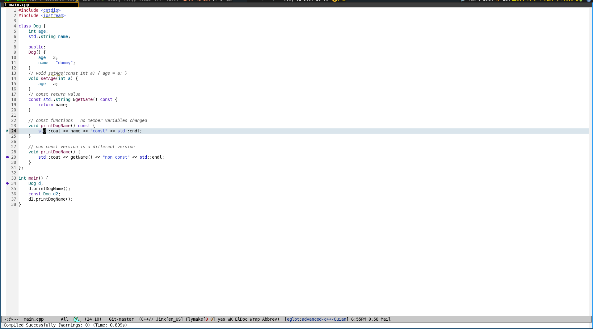
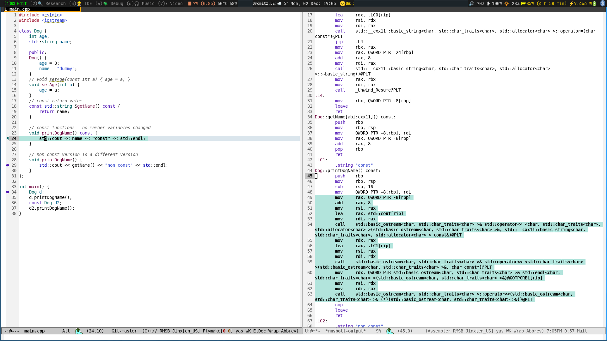

# Table of Contents

-   [Introduction](#org7715087)
    -   [CAVEAT](#org1a9f855)
-   [Installation](#org1390cb2)
    -   [use-package](#org5a56710)
    -   [customisation](#orge1cdc3d)
-   [screenshots](#orgb434981)
    -   [compile fails](#org9284674)
    -   [compile succeeds](#org7d2f44e)
    -   [blacklisted rmsbolt](#orgdede1a1)
-   [compilation-hide.el](#org8ff046c)
    -   [code](#orgfb68489)

# Introduction

Small Emacs utility package to auto hide successful compilation buffers unless blacklisted in [compilation-hide-persistent-buffers](compilation-hide.el). The code shamelessly borrowed from  <https://emacs.stackexchange.com/a/73673/9851>. The default value of the blacklist is simply for the great [rmsbolt](https://github.com/emacsmirror/rmsbolt).

## CAVEAT

This is a very rough first draft. It "works for me" :)

# Installation

## use-package

I use [straight.el](https://github.com/radian-software/straight.el). It should be easy enough to just clone and point to if you use something else. You'd remove the **local-repo** directive I expect.

    
    (use-package compilation-hide
    :straight (compilation-hide :local-repo "~/development/projects/emacs/compilation-hide" :type git :host github :repo "rileyrg/compilation-hide.el" ))

## customisation

See compilation-hide-persistent-buffers

# screenshots

## compile fails

## compile succeeds

## blacklisted rmsbolt

# compilation-hide.el

link: [compilation-hide.el](compilation-hide.el)

## code

      ;;; compilation-hide.el --- hide successful compilation buffers unless configured otherwise
      ;;
      ;; maintained in compilation-hide.org
      ;;
      ;; Copyright (C) 2010-2024 rileyrg
      ;;
      ;; Author: rileyrg <rileyrg@gmx.de>
      ;; Created: 2 December 2024
      ;; Keywords: internal lisp docs help maint tools
      ;; Version : 1.0
      ;; Package-Requires: ((emacs "25.1")
      ;; Optional :
      ;; URL: git@github.com/rileyrg/compilation-hide.el
      ;;
      ;; This program is free software; you can redistribute it and/or modify
      ;; it under the terms of the GNU General Public License as published by
      ;; the Free Software Foundation, either version 3 of the License, or
      ;; (at your option) any later version.
    
      ;; This program is distributed in the hope that it will be useful,
      ;; but WITHOUT ANY WARRANTY; without even the implied warranty of
      ;; MERCHANTABILITY or FITNESS FOR A PARTICULAR PURPOSE.  See the
      ;; GNU General Public License for more details.
    
      ;; You should have received a copy of the GNU General Public License
      ;; along with this program.  If not, see <https://www.gnu.org/licenses/>.
    
      ;;;
    
      ;;; commentary:
      ;; The code shamelessly borrowed from  https://emacs.stackexchange.com/a/73673/9851
      ;; and made into a package file with some customization to blacklist certain
      ;; compilation buffers from auto close.
    
    
      ;;
      ;; customization:
      ;;   see `compilation-hide-persistent-buffers'
      ;;
      ;;; code:
    
      (use-package emacs
    
        :init
    
        ;; https://emacs.stackexchange.com/a/73673/9851
    
        (defcustom compilation-hide-delay 0
          "Time in seconds before auto hiding compile buffer."
          :type 'number
          :group 'compilation-hide
          )
    
        (defcustom compilation-hide-persistent-buffers '("rmsbolt")
          "If any component of this list is contained in the compilation name, it wont be closed upon successful completion"
          :type '(repeat string)
          :group 'compilation-hide)
    
        (make-variable-buffer-local 'compilation-hide-start-time)
    
        (defun compilation-hide-buffer-if-successful (buffer string)
          (unless (string-match-p (regexp-opt compilation-hide-persistent-buffers) (buffer-name buffer))
            (setq compilation-total-time (time-subtract nil compilation-hide-start-time))
            (setq time-str (concat " (Time: " (format-time-string "%s.%3N" compilation-total-time) "s)"))
    
            (if (with-current-buffer buffer
                  (setq warnings (eval compilation-num-warnings-found))
                  (setq warnings-str (concat " (Warnings: " (number-to-string warnings) ")"))
                  (setq errors (eval compilation-num-errors-found))
                  (if (eq errors 0) nil t))
    
                ;;If Errors then
                (message (concat "Compiled with Errors" warnings-str time-str))
    
              ;;If Compiled Successfully or with Warnings then
              (progn
                (bury-buffer buffer)
                (run-with-timer compilation-hide-delay nil 'delete-window (get-buffer-window buffer 'visible))
                (message (concat "Compiled Successfully" warnings-str time-str))))))
    
        (defun compilation-hide-compilation-started (proc)
          (setq compilation-hide-start-time (current-time)))
    
        :hook
        (compilation-start .  compilation-hide-compilation-started)
        (compilation-finish-functions . compilation-hide-buffer-if-successful))
    (provide 'compilation-hide)

